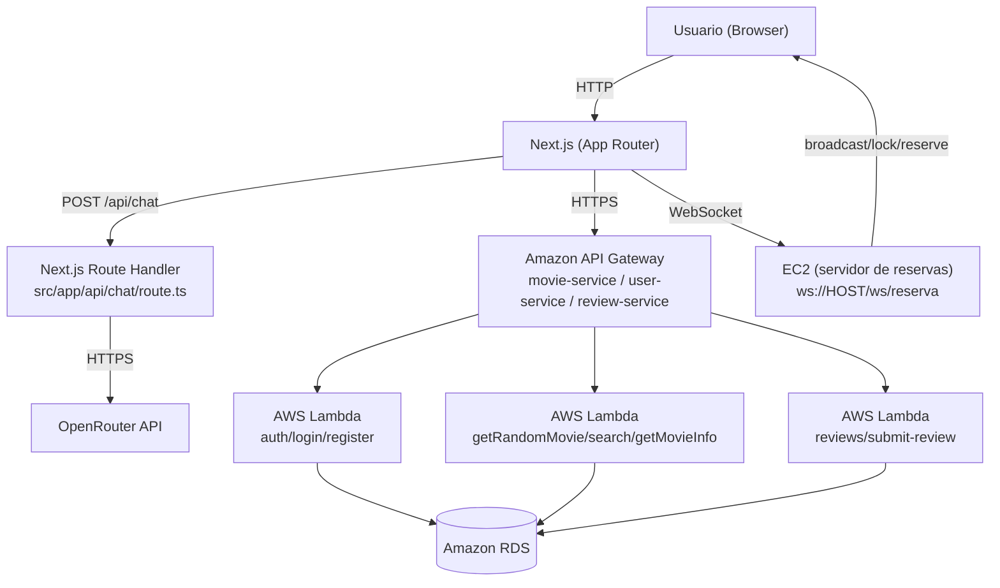

## Letter Boxd

Aplicação web (Next.js) inspirada em plataformas de cinema: catálogo de filmes, página de detalhes, reviews da comunidade, bilheteria/seleção de assentos e um chat (`/api/chat`) para conversar sobre filmes.

## Visão geral (AWS)

Este projeto foi pensado para rodar **conectado à AWS**, com o frontend em Next.js consumindo serviços publicados na nuvem.

Estamos utilizando os serviços de:

- **Amazon RDS**: banco relacional (persistência de usuários/reviews e dados relacionados no backend).
- **Amazon API Gateway**: camada de entrada HTTP para os serviços (endpoints `execute-api`).
- **AWS Lambda**: funções serverless (código disponível em `src/app/lambda/`) que implementam os casos de uso de autenticação, catálogo e reviews.
- **Amazon EC2**: serviço de tempo-real para a bilheteria (seleção de assentos), via **WebSocket**. No código atual, o modal usa `ws://13.222.117.47:8000/ws/reserva`.

Além disso, existe um endpoint interno do próprio Next.js:

- **`POST /api/chat`**: rota server-side no Next.js que integra com OpenRouter (LLM) via `OPENROUTER_API_KEY`.

## Fluxograma da arquitetura



## Fluxos principais (como o código se conecta na AWS)

- **Filmes (catálogo / busca / detalhes)**:
  - A UI chama funções em `src/app/hooks/movie-service/service.ts`
  - Essas funções fazem `fetch` para endpoints do **API Gateway** (ex.: `.../movie-service/get-random-movie`, `.../movie-service/search-movie`, `.../movie-service/get-movie`)
  - O API Gateway roteia para **Lambdas** (código de referência em `src/app/lambda/`) e, quando necessário, persistência/consulta no **RDS**

- **Usuário (cadastro/login/autenticação)**:
  - A UI chama `src/app/hooks/user-service/service.ts`
  - Os requests vão para `.../user-service/register`, `.../user-service/login`, `.../user-service/auth` via **API Gateway**
  - A autenticação usa `credentials: 'include'` em algumas chamadas (sessão/cookies no domínio do API Gateway, dependendo da configuração de CORS/cookies)

- **Reviews**:
  - A UI chama `src/app/hooks/review-service/service.ts`
  - Leitura e envio usam endpoints do **API Gateway** (ex.: `.../review-service` e `.../review-service/submit-review`)
  - O backend (Lambda) persiste/consulta no **RDS**

- **Bilheteria (Filmes em cartaz / escolha de sessão / sala distribuída)**:
  - A página `src/app/bilheteria/page.tsx` abre o modal `src/app/components/SeatSelectorModal.tsx` quando o usuário escolhe um horário
  - O modal conecta via **WebSocket** (`wsUrl`) a um serviço em **EC2**, que coordena bloqueio/reserva/confirmação em tempo real (ex.: ação `"bloquear"` e `"confirmar_pagamento"`)

## Stack

- **Next.js (App Router)**

- **React + TypeScript**

- **Tailwind CSS**

- **Testes**: Jest + Testing Library

- **CI**: GitHub Actions

## Requisitos

- **Node.js 20+**

- **npm** (recomendado por causa do `package-lock.json`)

## Como rodar localmente


1) Instale dependências:


```bash

npm ci

```


2) Rode em modo dev:


```bash

npm run dev

```

Acesse `http://localhost:3000`.

## Variáveis de ambiente

### Chat (OpenRouter)

A rota `POST /api/chat` usa OpenRouter via SDK do OpenAI.

- **`OPENROUTER_API_KEY`**: chave do OpenRouter.

Sem essa variável, o build passa normalmente, mas a rota `/api/chat` retorna erro 500 em runtime.

Exemplo (`.env.local`):

```bash

OPENROUTER_API_KEY=seu_token_aqui

```

## Scripts úteis

- **`npm run dev`**: inicia o servidor de desenvolvimento

- **`npm run build`**: build de produção (Next.js)

- **`npm run start`**: roda o build em produção

- **`npm run lint`**: ESLint

- **`npm run typecheck`**: TypeScript (`tsc --noEmit`)

- **`npm run test`**: Jest

- **`npm run test:ci`**: Jest em modo CI (`--ci --runInBand`)


## Testes


Os testes ficam em `src/__tests__/`.


Para rodar:


```bash

npm run test

```


## CI (GitHub Actions)


O workflow está em `.github/workflows/ci.yml`.


Ele executa:


- `npm ci`

- `npm run lint`

- `npm run typecheck`

- `npm run test:ci`

- `npm run build`


### Quando roda


- Em **Pull Requests**

- Em **push na branch `main`** (pode ser ajustado para outras branches no YAML)

- Manualmente via **Actions → CI → Run workflow** (quando disponível no repositório)


## Estrutura (visão rápida)


- **`src/app/`**: páginas/rotas (App Router)

- **`src/app/components/`**: componentes React

- **`src/app/api/chat/route.ts`**: endpoint do chat

- **`src/app/hooks/*/service.ts`**: chamadas para APIs externas (movie-service, user-service, review-service)

- **`src/app/lambda/`**: código das funções Lambda (referência/implantação na AWS)

- **`src/__tests__/`**: testes (Jest/Testing Library)

## Estrutura (detalhada)

- **Páginas (App Router)**:
  - **`src/app/page.tsx`**: home (carrega filmes aleatórios via `getRandomMovie`)
  - **`src/app/movies/page.tsx`**: catálogo + busca (API Gateway)
  - **`src/app/movie/[id]/page.tsx`**: detalhes do filme + reviews + chat (API Gateway + `/api/chat`)
  - **`src/app/bilheteria/page.tsx`**: filmes em cartaz + seleção de sessão (abre o modal de assentos)

- **Integrações com backend AWS (client-side)**:
  - **`src/app/hooks/movie-service/service.ts`**: integrações do catálogo (API Gateway)
  - **`src/app/hooks/user-service/service.ts`**: cadastro/login/auth (API Gateway)
  - **`src/app/hooks/review-service/service.ts`**: listar/enviar reviews (API Gateway)
  - Observação: os `route.ts` dentro de `src/app/hooks/*/` estão atualmente comentados e não são usados como proxy.

- **Bilheteria em tempo real (sistema distribuído)**:
  - **`src/app/components/SeatSelectorModal.tsx`**: cliente WebSocket (bloqueio/reserva/pagamento)
  - **`src/app/bilheteria/page.tsx`**: injeta `sessionId` e `wsUrl` (EC2)

- **Lambdas (backend)**:
  - **`src/app/lambda/`**: exemplos/código das funções Lambda (ex.: `login.mjs`, `register.mjs`, `getMovieInfo.mjs`, `getReviewById.mjs`)

## Onde ajustar URLs/ambiente (AWS)

Atualmente, as URLs do **API Gateway** e do **WebSocket (EC2)** estão **hardcoded** no código:

- **API Gateway**: `src/app/hooks/*/service.ts` (domínios `*.execute-api.us-east-1.amazonaws.com`)
- **WebSocket (EC2)**: `src/app/bilheteria/page.tsx` (prop `wsUrl`)

Se você quiser “parametrizar” por ambiente (dev/homolog/prod), o caminho comum é mover isso para variáveis como `NEXT_PUBLIC_API_GATEWAY_BASE_URL` e `NEXT_PUBLIC_WS_URL` (mantendo o `OPENROUTER_API_KEY` no server).


## Troubleshooting


- **CI falha com “Missing script: typecheck/test:ci”**

  - Garanta que o `package.json` tem os scripts `typecheck` e `test:ci`, e suba também o `package-lock.json`.


- **`next build` falha por variável de ambiente**

  - O projeto foi ajustado para não exigir `OPENROUTER_API_KEY` no build, mas a rota `/api/chat` precisa dela em runtime.

Devs: Marcelle de Paula (@marczlle) e Pedro Vieira (@Pedro-hashm)
